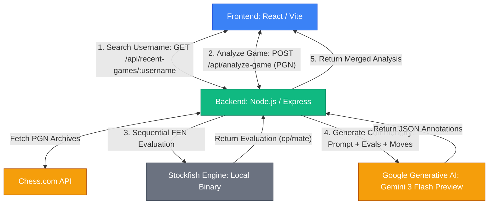

# Chess Analyzer - Architecture and Design Document

## Architecture Diagram

## System Components

1. **Frontend (React/Vite)**
   - **Role:** Handles user input, fetches data from the backend, and provides an interactive interface to replay chess games.
   - **Key Modules:** Contains a custom lightweight chessboard component to visualize the game state and an analysis panel to display move evaluations and Grandmaster commentary.

2. **Backend (Node.js/Express)**
   - **Role:** Orchestrates the flow of data between external APIs, the local chess engine, and the LLM. 
   - **Key Modules:**
     - **Chess.js:** Used to parse PGNs, validate moves, and generate Fen (Forsyth-Edwards Notation) strings for every position.
     - **Stockfish Controller:** Spawns a local Stockfish executable to analyze positions.
     - **LLM Integrator:** Constructs prompts and communicates with the Gemini API to get contextual annotations.

3. **External Services**
   - **Chess.com API:** Used to retrieve a user's recent game archives.
   - **Gemini API (`gemini-3-flash-preview`):** Used to act as the "Grandmaster," providing human-readable, strategic insights based on the move sequence and Stockfish evaluations.

## Implementation Choices & Alternatives Rejected

### 1. Stockfish Execution: Sequential vs. Parallel
- **Choice:** Evaluates move FENs **sequentially** using a single spawned instance of the Stockfish engine.
- **Alternative Rejected:** Parallel execution (spawning a Stockfish process for every move simultaneously).
- **Reason:** While parallel execution is theoretically faster, it caused severe resource exhaustion (OOM/CPU bottleneck) leading to VM crashes because a typical chess game has 40-80 moves, and spawning that many Stockfish instances simultaneously overwhelmed the system.

### 2. Chessboard Component: Custom vs. Third-Party Library
- **Choice:** Developed a **Custom lightweight chessboard** component.
- **Alternative Rejected:** Using established libraries like `react-chessboard`.
- **Reason:** Compatibility and stability issues with React 19. The custom board ensures full control over rendering and avoids relying on dependencies that may not yet be fully compatible with the latest React version.

### 3. LLM Commentary Strategy
- **Choice:** Batching all moves and their corresponding Stockfish evaluations into a **single comprehensive prompt** sent to `gemini-3-flash-preview`, requesting a JSON array of annotations.
- **Alternative Rejected:** Calling the LLM API individually for every single move.
- **Reason:** A single request significantly reduces API latency, avoids hitting strict rate limits (HTTP 429 Too Many Requests), and provides the LLM with the full context of the game, resulting in more coherent and contextual commentary.

### 4. LLM Model Selection
- **Choice:** `gemini-3-flash-preview`
- **Alternative Rejected:** `gemini-2.0-flash` and older models.
- **Reason:** Due to rate limiting and API quota constraints observed during testing, `gemini-3-flash-preview` provided the best balance of availability, response quality (specifically returning strictly formatted JSON without markdown stripping errors), and conversational reasoning required for the GM persona.
